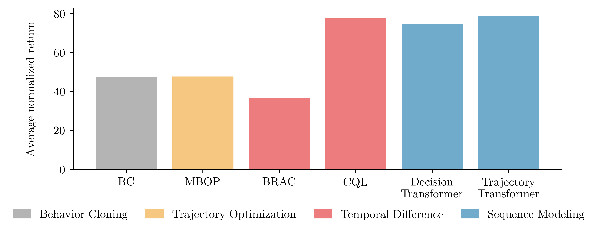

# Trajectory Transformer

Code release for [Reinforcement Learning as One Big Sequence Modeling Problem](https://arxiv.org/abs/2106.02039).

## Installation

All python dependencies are in [`environment.yml`](environment.yml). Install with:

```
conda env create -f environment.yml
conda activate trajectory
pip install -e .
```

For reproducibility, we have also included system requirements in a [`Dockerfile`](azure/Dockerfile) (see [installation instructions](#Docker)), but the conda installation should work on most standard Linux machines.

## Usage

Train a transformer with:
```
python scripts/train.py --dataset halfcheetah-medium-v2
```

To reproduce the offline RL results:
```
python scripts/plan.py --dataset halfcheetah-medium-v2
```

By default, this will use the hyperparameters in [`config/offline.py`](config/offline.py). You can override any hyperparameter with a runtime flag, _e.g._:
```
python scripts/plan.py --dataset halfcheetah-medium-v2 \
	--horizon 5 --beam_width 32
```
## Pretrained models

We have provided pretrained models for 16 datasets:
```
{halfcheetah, hopper, walker2d, ant}
	x
{expert-v2, medium-expert-v2, medium-v2, medium-replay-v2}
```

Download them with:

```
./pretrained.sh
```

The models will be saved in `logs/$DATASET/gpt/pretrained`. To plan with these models, refer to them using the `gpt_loadpath` flag:
```
python scripts/plan.py --dataset halfcheetah-medium-v2 --gpt_loadpath gpt/pretrained
```

This script will also download 15 plans from each model, saved to `logs/$DATASET/plans/pretrained`. To read these results, run:
```
python plotting/read_results.py
```

To create the table of offline RL results from the paper, run:
```
python plotting/table.py
```

<details>
<summary>This will output a table that can be copied into a Latex document. Expand to view.</summary>

```
\begin{table*}[h]
\centering
\small
\begin{tabular}{llrrrrrr}
\toprule
\multicolumn{1}{c}{\bf Dataset} & \multicolumn{1}{c}{\bf Environment} & \multicolumn{1}{c}{\bf BC} & \multicolumn{1}{c}{\bf MBOP} & \multicolumn{1}{c}{\bf BRAC} & \multicolumn{1}{c}{\bf CQL} & \multicolumn{1}{c}{\bf DT} & \multicolumn{1}{c}{\bf TT (Ours)} \\ 
\midrule
Medium-Expert & HalfCheetah & $59.9$ & $105.9$ & $41.9$ & $62.4$ & $86.8$ & $95.0$ \scriptsize{\raisebox{1pt}{$\pm 0.2$}} \\ 
Medium-Expert & Hopper & $79.6$ & $55.1$ & $0.9$ & $111.0$ & $107.6$ & $110.0$ \scriptsize{\raisebox{1pt}{$\pm 2.7$}} \\ 
Medium-Expert & Walker2d & $36.6$ & $70.2$ & $81.6$ & $98.7$ & $108.1$ & $101.9$ \scriptsize{\raisebox{1pt}{$\pm 6.8$}} \\ 
Medium-Expert & Ant & $-$ & $-$ & $-$ & $-$ & $-$ & $116.1$ \scriptsize{\raisebox{1pt}{$\pm 9.0$}} \\ 
\midrule
Medium & HalfCheetah & $43.1$ & $44.6$ & $46.3$ & $44.4$ & $42.6$ & $46.9$ \scriptsize{\raisebox{1pt}{$\pm 0.4$}} \\ 
Medium & Hopper & $63.9$ & $48.8$ & $31.3$ & $58.0$ & $67.6$ & $61.1$ \scriptsize{\raisebox{1pt}{$\pm 3.6$}} \\ 
Medium & Walker2d & $77.3$ & $41.0$ & $81.1$ & $79.2$ & $74.0$ & $79.0$ \scriptsize{\raisebox{1pt}{$\pm 2.8$}} \\ 
Medium & Ant & $-$ & $-$ & $-$ & $-$ & $-$ & $83.1$ \scriptsize{\raisebox{1pt}{$\pm 7.3$}} \\ 
\midrule
Medium-Replay & HalfCheetah & $4.3$ & $42.3$ & $47.7$ & $46.2$ & $36.6$ & $41.9$ \scriptsize{\raisebox{1pt}{$\pm 2.5$}} \\ 
Medium-Replay & Hopper & $27.6$ & $12.4$ & $0.6$ & $48.6$ & $82.7$ & $91.5$ \scriptsize{\raisebox{1pt}{$\pm 3.6$}} \\ 
Medium-Replay & Walker2d & $36.9$ & $9.7$ & $0.9$ & $26.7$ & $66.6$ & $82.6$ \scriptsize{\raisebox{1pt}{$\pm 6.9$}} \\ 
Medium-Replay & Ant & $-$ & $-$ & $-$ & $-$ & $-$ & $77.0$ \scriptsize{\raisebox{1pt}{$\pm 6.8$}} \\ 
\midrule
\multicolumn{2}{c}{\bf Average (without Ant)} & 47.7 & 47.8 & 36.9 & 63.9 & 74.7 & 78.9 \hspace{.6cm} \\ 
\multicolumn{2}{c}{\bf Average (all settings)} & $-$ & $-$ & $-$ & $-$ & $-$ & 82.2 \hspace{.6cm} \\ 
\bottomrule
\end{tabular}
\label{table:d4rl}
\end{table*}
```



</details>

To create the averaged results plots, run:
```
python plotting/plot.py
```
The plot will be saved to [`plotting/bar.pdf`](plotting/bar.pdf)

## Docker

Copy your MuJoCo key to the Docker build context and build the container:
```
cp ~/.mujoco/mjkey.txt azure/files/
docker build -f azure/Dockerfile . -t trajectory
```

Test the container:
```
docker run -it --rm --gpus all \
	--mount type=bind,source=$PWD,target=/home/code \
	--mount type=bind,source=$HOME/.d4rl,target=/root/.d4rl \
	trajectory \
	bash -c \
	"export PYTHONPATH=$PYTHONPATH:/home/code && \
	python /home/code/scripts/train.py --dataset hopper-medium-expert-v2 --exp_name docker/"
```

## Running on Azure

#### Setup

1. Launching jobs on Azure requires one more python dependency:
```
pip install git+https://github.com/JannerM/doodad.git@janner
```

2. Tag the image built in [the previous section](#Docker) and push it to Docker Hub:
```
export DOCKER_USERNAME=$(docker info | sed '/Username:/!d;s/.* //')
docker tag trajectory ${DOCKER_USERNAME}/trajectory:latest
docker image push ${DOCKER_USERNAME}/trajectory
```

3. Update [`azure/config.py`](azure/config.py), either by modifying the file directly or setting the relevant [environment variables](azure/config.py#L47-L52). To set the `AZURE_STORAGE_CONNECTION` variable, navigate to the `Access keys` section of your storage account. Click `Show keys` and copy the `Connection string`.

4. Download [`azcopy`](https://docs.microsoft.com/en-us/azure/storage/common/storage-use-azcopy-v10) to `bin`:
```
./azure/download.sh
```

#### Usage

Launch training jobs with
```
python azure/launch_train.py
```
and planning jobs with
```
python azure/launch_plan.py
```

These scripts do not take runtime arguments. Instead, they run the corresponding scripts ([`scripts/train.py`](scripts/train.py) and [`scripts/plan.py`](scripts/plan.py), respectively) using the Cartesian product of the parameters in [`params_to_sweep`](azure/launch_train.py#L36-L38).

#### Viewing results

To rsync the results from the Azure storage container, run
```
./azure/sync.sh
```

To mount the storage container, first create a blobfuse config with
```
./azure/make_fuse_config.sh
```
and then mount with
```
./azure/mount.sh
```
This will mount the storage container to a new folder called `mount/`. To unmount and remove the folder, run
```
./azure/umount.sh
```

## Reference
```
@article{janner2021sequence,
  title={Reinforcement Learning as One Big Sequence Modeling Problem},
  author={Michael Janner and Qiyang Li and Sergey Levine},
  journal={arXiv preprint arXiv:2106.02039},
  year={2021},
}
```

## Acknowledgements

The GPT implementation is from Andrej Karpathy's [minGPT](https://github.com/karpathy/minGPT) repo.
